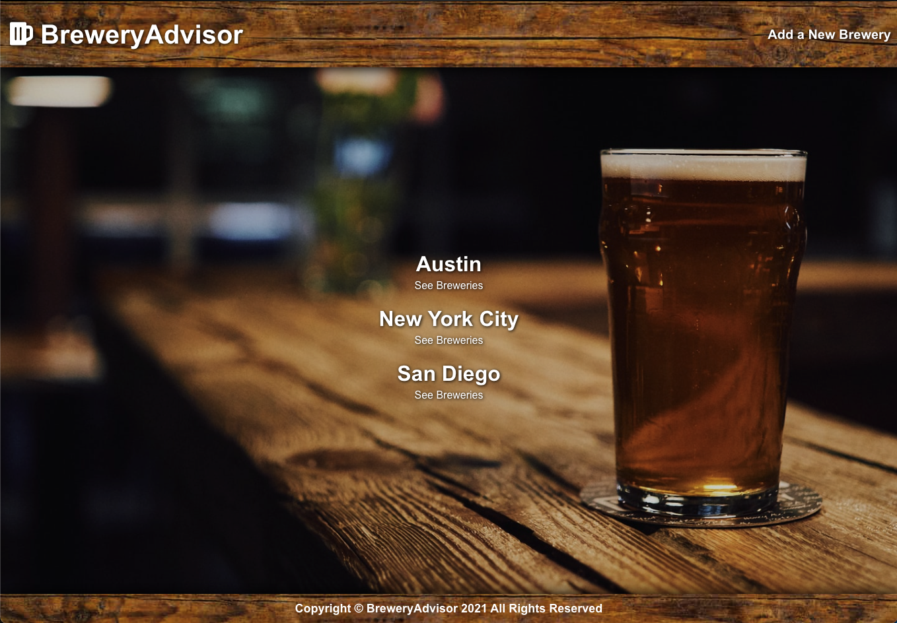
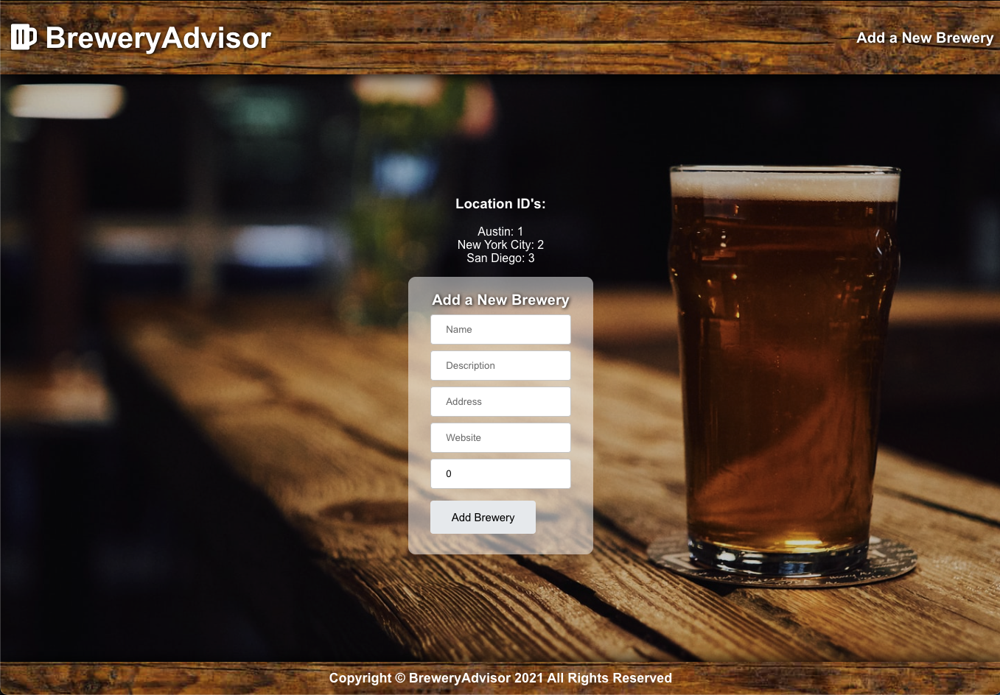
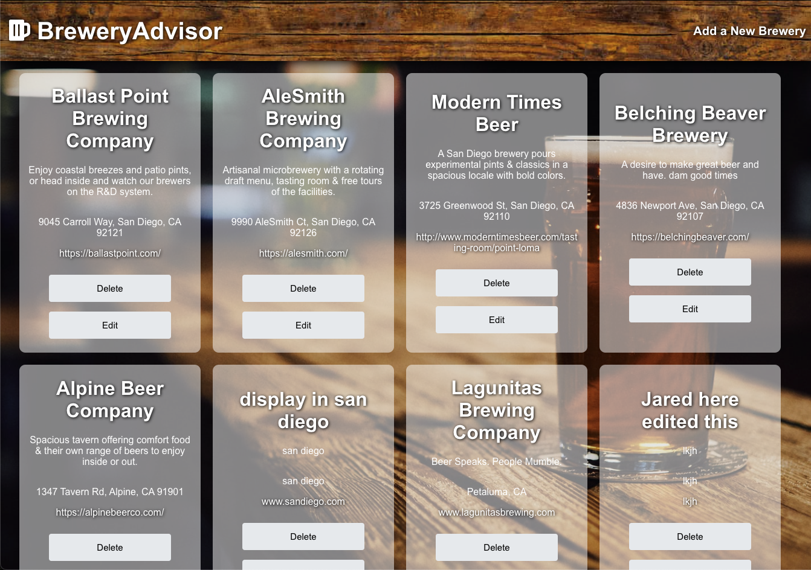

# Brewery Advisor

Your Go to App for Breweries in your area

Currently supporting breweries in Austin, TX, New York, NY and San Diego, CA.

## Technologies Used

- Javascript
- ReactJS
- CSS3
- HTML5
- React Router
- Ruby on Rails API
- Font Awesome
- Git

## Approach Taken

- We collaborated on an idea, used a Trello Board to divide tasks and an Invsion board to develop a wireframe and ERD. We spent some time figuring out how to collaborate on Git and GitHub before moving forward on anything.

### Responsibilities

We divided up the tasks as such:

- Product Manager and Back-End Lead - Danielle Koski
- Front-End Lead - Jared Long
- Release Manager - Seven Hong

Although these roles we defined, we collaborated and were involved in each part.

## Wireframes

Initial mock ups

Home Page

Selection Page

## Final Product

Home Page

Add Brewery Page

Selection Page

## Click here to explore our app:

<a href="https://brewery-advisor-app.herokuapp.com/" target="_blank">Brewery Advisor</a>

## Future Updates

- Add Authentication
- Add more cities
